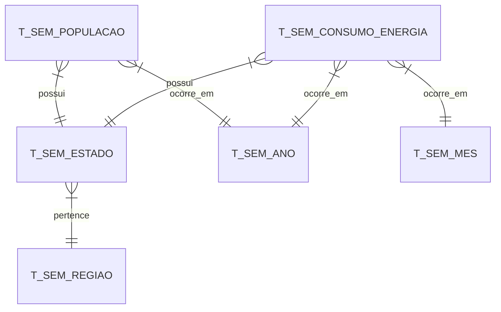

# Análise de Consumo Energético Brasileiro - Pipeline de Dados

## Descrição
Este projeto implementa um pipeline de dados para análise do consumo energético brasileiro, utilizando dados oficiais do Governo Federal. O sistema processa, armazena e analisa dados históricos de consumo de energia elétrica e população, permitindo análises de tendências e consumo per capita.

## Estrutura do Banco de Dados
O modelo de dados foi projetado para suportar análises temporais e geográficas do consumo energético:

### Tabelas Principais:
- **T_SEM_CONSUMO_ENERGIA**: Registros mensais de consumo por estado
- **T_SEM_POPULACAO**: Dados populacionais por estado/ano
- **T_SEM_ESTADO**: Cadastro de estados
- **T_SEM_REGIAO**: Regiões do Brasil
- **T_SEM_MES**: Dimensão temporal (meses)
- **T_SEM_ANO**: Dimensão temporal (anos)

### Relacionamentos:


## Pipeline de Dados

### 1. Extração e Preparo dos Dados
- **getPopulacao.ipynb**: Script para processamento de dados populacionais
  - Carrega dados do SIDRA/IBGE
  - Realiza interpolação para anos faltantes
  - Projeta população futura usando regressão linear
  - Armazena na tabela T_SEM_POPULACAO

- **Part4.ipynb**: Script para processamento de dados de consumo
  - Processa planilha de consumo energético
  - Normaliza dados mensais
  - Mapeia estados e códigos
  - Armazena na tabela T_SEM_CONSUMO_ENERGIA

### 2. Transformações
- Limpeza e padronização de dados
- Conversão de unidades para MWh
- Normalização de nomes de estados
- Mapeamento de códigos IBGE
- Tratamento de valores nulos
- Interpolação de dados faltantes

### 3. Análises Disponíveis

#### Análises Temporais
- Evolução do consumo por estado/região
- Tendências anuais e sazonalidade
- Projeções de consumo futuro

#### Análises Geográficas
- Distribuição do consumo por região
- Comparativo entre estados
- Mapas de calor de consumo

#### Indicadores Per Capita
- Consumo por habitante
- Eficiência energética regional
- Tendências populacionais vs consumo

## Arquivos do Projeto
```
projeto/
│
├── notebooks/
│   ├── getPopulacao.ipynb    # Processamento dados populacionais
│   └── Part4.ipynb           # Processamento dados de consumo
│
├── sql/
│   └── script.ddl            # Scripts de criação do banco
│
├── data/
│   └── raw/                  # Dados brutos
│
└── resultados/
    ├── dados/                # Análises em CSV
    └── graficos/             # Visualizações geradas
```

## Tecnologias Utilizadas
- Python 3.x
- Pandas
- NumPy
- Matplotlib
- Oracle Database
- Jupyter Notebooks

## Como Executar

1. Configuração do Ambiente:
```bash
python -m venv env
source env/bin/activate  # Linux/Mac
env\Scripts\activate     # Windows
pip install -r requirements.txt
```

2. Configuração do Banco:
```bash
# Executar script.ddl no Oracle SQL Developer
```

3. Execução dos Notebooks:
```bash
jupyter notebook
# Executar getPopulacao.ipynb
# Executar Part4.ipynb
```

## Insights Gerados
1. **Tendências de Consumo**
   - Análise histórica de 2004-2024
   - Identificação de padrões sazonais
   - Projeções de demanda futura

2. **Distribuição Regional**
   - Mapeamento de áreas de alto consumo
   - Identificação de disparidades regionais
   - Oportunidades de eficiência energética

3. **Consumo Per Capita**
   - Indicadores de eficiência por região
   - Correlação com fatores socioeconômicos
   - Benchmarking entre estados

## Próximos Passos
1. Implementação de análises preditivas
2. Integração com outras fontes de dados
3. Desenvolvimento de dashboard interativo
4. Automação do pipeline de atualização

## Autores
[Seu Nome]

## Licença
Este projeto está sob a licença MIT.
