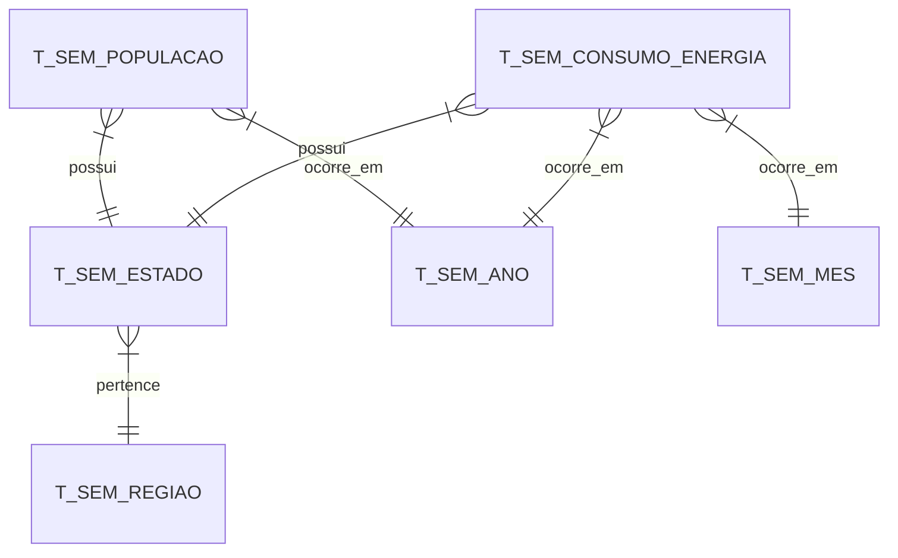

# FIAP - Faculdade de Informática e Administração Paulista

<p align="center">
<a href= "https://www.fiap.com.br/"></a>
</p>

<br>

# Cognitive Data Science (CDS)

## Integrantes: 
- <a href="https://www.linkedin.com/in/joseandrefilho">Jose Andre Filho</a>

## Professores:
### Tutor 
- <a href="https://www.linkedin.com/in/lucas-gomes-moreira-15a8452a/">Lucas Gomes Moreira</a>
### Coordenador
- <a href="https://www.linkedin.com/in/profandregodoi/">André Godoi Chiovato</a>

# Análise de Consumo Energético Brasileiro - Pipeline de Dados

## Descrição
Este projeto implementa um pipeline de dados para análise do consumo energético brasileiro, utilizando dados oficiais do Governo Federal. O sistema processa, armazena e analisa dados históricos de consumo de energia elétrica e população, permitindo análises de tendências e consumo per capita.

## Estrutura do Banco de Dados
O modelo de dados foi projetado para suportar análises temporais e geográficas do consumo energético:

### Tabelas Principais:
- **T_SEM_CONSUMO_ENERGIA**: Registros mensais de consumo por estado
- **T_SEM_POPULACAO**: Dados populacionais por estado/ano
- **T_SEM_ESTADO**: Cadastro de estados
- **T_SEM_REGIAO**: Regiões do Brasil
- **T_SEM_MES**: Dimensão temporal (meses)
- **T_SEM_ANO**: Dimensão temporal (anos)

### Relacionamentos:


## Pipeline de Dados

### 1. Extração e Preparo dos Dados
- **getPopulacao.ipynb**: Script para processamento de dados populacionais
  - Carrega dados do SIDRA/IBGE
  - Realiza interpolação para anos faltantes
  - Projeta população futura usando regressão linear
  - Armazena na tabela T_SEM_POPULACAO

- **Part4.ipynb**: Script para processamento de dados de consumo
  - Processa planilha de consumo energético
  - Normaliza dados mensais
  - Mapeia estados e códigos
  - Armazena na tabela T_SEM_CONSUMO_ENERGIA

### 2. Transformações
- Limpeza e padronização de dados
- Conversão de unidades para MWh
- Normalização de nomes de estados
- Mapeamento de códigos IBGE
- Tratamento de valores nulos
- Interpolação de dados faltantes

### 3. Análises Disponíveis

#### Análises Temporais
- Evolução do consumo por estado/região
- Tendências anuais e sazonalidade
- Projeções de consumo futuro

#### Análises Geográficas
- Distribuição do consumo por região
- Comparativo entre estados
- Mapas de calor de consumo

#### Indicadores Per Capita
- Consumo por habitante
- Eficiência energética regional
- Tendências populacionais vs consumo

## Arquivos do Projeto
```
3_CDS/
│
├── mer/
│   ├── Modelo_SEM.dmd        # Modelo de dados populacionais
│   ├── Logical.png           # Diagrama lógico de dados populacionais
│   └── Relational.png        # Diagrama relacional de dados de consumo
│
├── notebooks/
│   ├── db/
│   │   └── connection.py                # Script para conexão ao banco de dados
│   ├── data/
│   │   └── raw/                         # Dados brutos
│   ├── analise_consumo_energia.ipynb    # Análise de consumo de energia
│   ├── get_populacao.ipynb              # Extração de dados populacionais
│   └── get_consumo_energia.ipynb        # Extração de dados de consumo de energia
│
└── sql/
    └── script.ddl            # Scripts para criação do banco de dados

```

## Tecnologias Utilizadas
- Python 3.x
- Pandas
- NumPy
- Matplotlib
- Oracle Database
- Jupyter Notebooks

---

## Como Executar

1. **Configuração do Ambiente:**
   ```bash
   python -m venv env
   source env/bin/activate  # Linux/Mac
   env\Scripts\activate     # Windows
   pip install -r requirements.txt
   ```

2. **Configuração do Banco:**
   - Crie o banco de dados utilizando `script.ddl`.

3. **Configuração do `.env`**:
   - Crie um arquivo `.env` na raiz com as seguintes variáveis:
     ```plaintext
     DB_USER=
     DB_PASSWORD=
     DB_DSN=
     ```
   - Preencha os valores conforme a configuração do seu banco de dados Oracle.

4. **Execução dos Notebooks:**
   ```bash
   jupyter notebook
   ```
   - Execute os seguintes notebooks:
     - `get_populacao.ipynb`
     - `get_consumo_energia.ipynb`
     - `analise_consumo_energia.ipynb`

---

## Insights Gerados
1. **Tendências de Consumo**
   - Análise histórica de 2004-2024
   - Identificação de padrões sazonais
   - Projeções de demanda futura

2. **Distribuição Regional**
   - Mapeamento de áreas de alto consumo
   - Identificação de disparidades regionais
   - Oportunidades de eficiência energética

3. **Consumo Per Capita**
   - Indicadores de eficiência por região
   - Correlação com fatores socioeconômicos
   - Benchmarking entre estados

## Licença

<p xmlns:cc="http://creativecommons.org/ns#" xmlns:dct="http://purl.org/dc/terms/"><a property="dct:title" rel="cc:attributionURL" href="https://github.com/agodoi/template">MODELO GIT FIAP</a> por <a rel="cc:attributionURL dct:creator" property="cc:attributionName" href="https://fiap.com.br">Fiap</a> está licenciado sobre <a href="http://creativecommons.org/licenses/by/4.0/?ref=chooser-v1" target="_blank" rel="license noopener noreferrer" style="display:inline-block;">Attribution 4.0 International</a>.</p>
